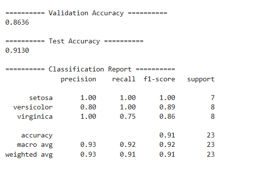
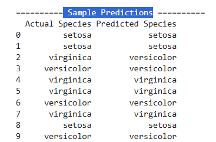

# Iris Flower Classification Using Machine Learning

## 📌 Project Overview

This project demonstrates the development of a machine learning classification model using the Iris dataset. A Random Forest Classifier was trained to predict the species of Iris flowers based on their physical measurements. The model was evaluated using multiple performance metrics to assess its classification accuracy.

---

## 🎯 Objective

- Build a machine learning classification model.
- Classify Iris flowers into three species.
- Evaluate model performance using test data.
- Understand the complete machine learning workflow.
- Gain hands-on experience with classification algorithms.

---

## 📂 Dataset Used

**Dataset:** Iris Dataset

**Source:** Scikit-learn

https://scikit-learn.org/stable/auto_examples/datasets/plot_iris_dataset.html

---

## 🛠️ Technologies Used

- Python
- Pandas
- Scikit-learn
- Random Forest Classifier
- Jupyter Notebook

---

## 🤖 Machine Learning Model

- Random Forest Classifier

---

## ✨ Key Features

- Loaded the Iris dataset using Scikit-learn.
- Explored dataset information and class distribution.
- Data preprocessing and label encoding.
- Train-Validation-Test Split (70%-15%-15%).
- Model training using Random Forest.
- Performance evaluation using multiple metrics.
- Classification Report.
- Confusion Matrix.
- Sample prediction comparison.

---

## 📊 Evaluation Metrics

- Validation Accuracy
- Test Accuracy
- Precision
- Recall
- F1-Score
- Confusion Matrix

---

## 📷 Project Screenshots
### Validation & Test Accuracy

### Sample Predictions 

## 📈 Key Findings

- The Random Forest Classifier successfully classified Iris flowers into three species.
- The model achieved approximately **86.36% Validation Accuracy** and **91.30% Test Accuracy**.
- The Classification Report showed strong Precision, Recall, and F1-Score across all classes.
- The Confusion Matrix indicated that most flowers were classified correctly, with only a few misclassifications between Versicolor and Virginica.
- The project demonstrates the effectiveness of Random Forest for multiclass classification problems.

---

## 📓 Notebook
https://github.com/priya666rout-lab/codeAlpha_Iris-Flower-Classification-using-Machine-Learning/blob/main/IRIS.ipynb

## 🚀 Repository

https://github.com/priya666rout-lab/codeAlpha_Iris-Flower-Classification-using-Machine-Learning

## 👩‍💻 Author

**Priya Rout**
B.Tech Computer Science & Engineering (Data Science)
Passionate about Data Science, Machine Learning, and Data Analytics.
